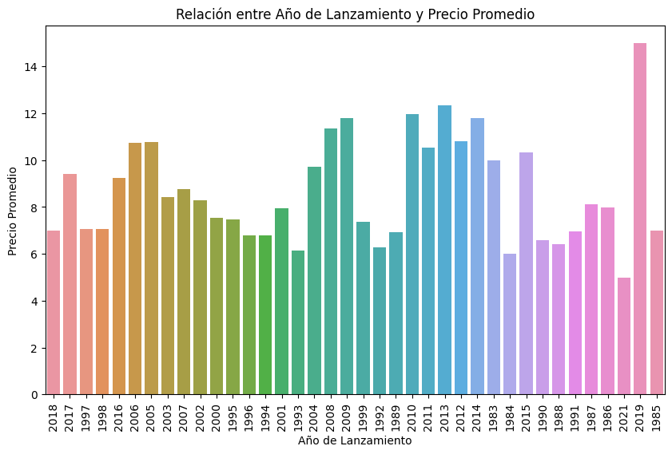
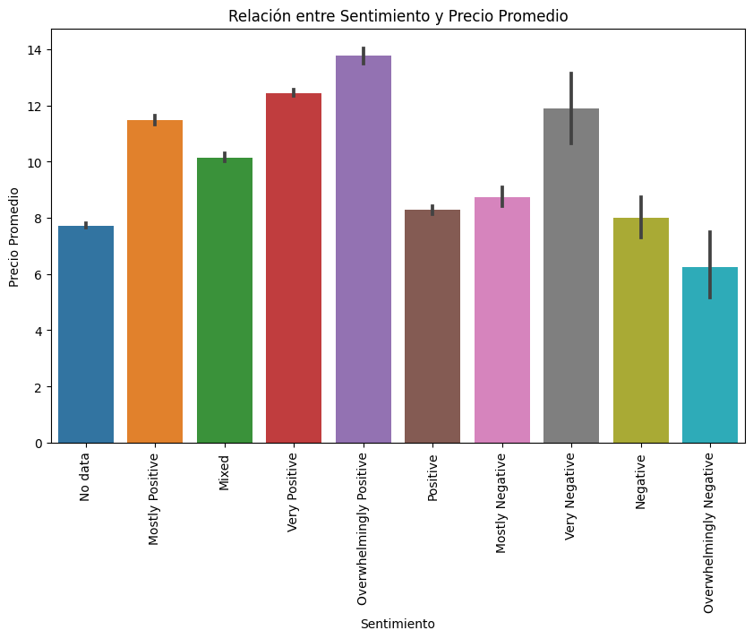

# ProyectoMLOPS

Machine Learning Operations (MLOps)

# Proyecto de Análisis y Predicción de Precios de Juegos de Steam

Este proyecto tiene como objetivo realizar un análisis completo de un dataset de juegos de la plataforma Steam, incluyendo un proceso de ETL, la creación de una API utilizando FastAPI, la implementación de un modelo de machine learning para predecir los precios de los juegos y la evaluación de su rendimiento utilizando la métrica RMSE.

## Funcionalidades

El proyecto consta de las siguientes funcionalidades principales:

1. **ETL Inicial**: Se realiza una transformación de datos (ETL) en el dataset de juegos de Steam para prepararlo para su análisis posterior.

2. **API con FastAPI**: Se implementa una API web utilizando FastAPI que permite acceder a 7 funciones relacionadas con el análisis de los juegos y una para predecir el precio.

3. **ETL para Machine Learning**: Se realiza una transformación adicional en los datos para adaptarlos al proceso de entrenamiento y prueba del modelo de machine learning.

4. **Análisis Exploratorio de Datos (EDA)**: Se lleva a cabo un análisis exploratorio de datos, del cual se obtienen conclusiones clave que se presentan en forma de imágenes.

5. **Modelo de Machine Learning**: Se crea un modelo de regresión para predecir el precio de un juego en función de ciertas características.

6. **Cálculo de RMSE**: Se calcula el Root Mean Squared Error (RMSE) para evaluar el rendimiento del modelo de predicción.

## EDA

Podemos ver en el siguiente grafico que en el 2019 tenemos una clara diferencia en el precio promedio, superando los $14. Ademas podemos ver que en el 2021 el promedio es el mas bajo con unos $5 promedio. Como conclusion por este fenomeno creo que pudo haber influenciado la pandemia por el COVID-19 y la enorme cantidad de compras de juegos de bajo costo obtenidas en este periodo.

Podemos ver en el siguiente grafico que los juegos que suelen tener un mayor precio son los que tienen una valoracion 'Overwhelmingly Positive', seguido de los 'Very Positive'. Detras de estos podemos encontrar los 'Very Negative' contando con algunos outliers que elevan el precio por sobre los 'Very Positive'. Por ultimo vemos que los juegos que tienen una valoracion 'Overwhelmingly Negative' son los que suelen tener menores precios.

## Consideraciones

Para el Modelo de Machine Learning no se tomaron en cuenta los juegos que superaban los $100 de precio, ya que a mi parecer, no eran muchos y me afectaban negativamente al rendimiento del modelo.
Ademas, si bien la columna Metascore era una buena medida a tener en cuenta a la hora de predecir el precio, no se tomo en cuenta debido a la gran cantidad de datos Nulos. Siendo alrededor de 24000 de un dataset de aproxidamente 30000. Creo que de haber tomado en cuenta la columna Metascore, hubiera perdido demasiada informacion. 
En este modelo se trato de usar la mayor cantidad de datos posibles para asemejarse a la realidad.

La API cuenta con 6 endpoints:
* Genero( Año: str ): Se ingresa un año y devuelve un diccionario de clave Año con los 5 géneros más ofrecidos en el orden correspondiente como valor.
* Juegos( Año: str ): Se ingresa un año y devuelve un diccionario de clave Año con una lista de los juegos lanzados en el año como valor.
* Specs( Año: str ): Se ingresa un año y devuelve un diccionario de clave Año con los 5 specs que más se repiten en el mismo en el orden correspondiente como valor.
* Earlyacces( Año: str ): Diccionario con la cantidad de juegos lanzados en un año con early access. Siendo Año la clave y la cantidad el valor.
* Sentiment( Año: str ): Según el año de lanzamiento, se devuelve un diccionario, de clave sentimiento y de valor la cantidad de registros asociados a ese Sentimiento (Positive: 200, Negative: 100).
* Metascore( Año: str ): Top 5 juegos según año con mayor metascore Siendo un diccionario de clave el nombre del juego y de valor el metascore.

Los parametros requeridos para hacer funcionar la prediccion del modelo mediante FastAPI son:

1. Publisher. En formato string el nombre de la empresa que publica el juego (Ubisoft, Epic Games, Valve)

2. Tag. En formato string el tipo de juego. (Action, Adventure, Indie, Simulator)

3. Sentiment. En formato string el sentimiento general del juego siguiendo las siguientes consideraciones:
* Overwhelmingly Positive
* Very Positive
* Positive
* Mostly Positive
* Mixed
* Mostly Negative
* Negative
* Very Negative
* Overwhelmingly Negative.
* No data

4. Anio. En formato string el anio de salida el juego (2016, 2017, 2018)

## Instalación y Uso

1. Clona este repositorio: `git clone https://github.com/FabianGonzalezz/ProyectoMLOPS`
2. Accede a la carpeta del proyecto: `cd PI_ML_OPS-ft`
3. Instala las dependencias: `pip install -r requirements.txt`
4. Ejecuta la API con FastAPI: `uvicorn main:app --reload`

Si tienes preguntas o comentarios, puedes contactarme en [Gmail](mailto:fabiann.m.gonzalez@gmail.com) o a través de mi perfil de GitHub: [Github](https://github.com/FabianGonzalezz/).
